# TigerbeetleMiniPIX Architecture

A comprehensive guide to the system design, data flows, component interactions, and settlement mechanics of TigerbeetleMiniPIX.

**Table of Contents**
- [System Overview](#system-overview)
- [High-Level Architecture](#high-level-architecture)
- [Component Details](#component-details)
- [Data Flow](#data-flow)
- [Settlement Engine](#settlement-engine)
- [Ledger & Account Model](#ledger--account-model)
- [Concurrency & Performance](#concurrency--performance)
- [Error Handling & Recovery](#error-handling--recovery)
- [Testing & Verification](#testing--verification)

---

## System Overview

TigerbeetleMiniPIX is a payment settlement simulator that demonstrates atomic payment processing using TigerBeetle's transfer mechanism. The system is built around a **3-legged settlement model** with **2-phase commit (2PC)** to ensure zero partial states.

### Core Principles

1. **Atomicity**: All payment legs either succeed together or fail together
2. **Idempotency**: Deterministic transfer IDs prevent duplicate processing
3. **Offset Management**: Consumer offset commits only after settlement completes
4. **Deterministic Routing**: Single-ledger with code-based account classification (no multi-ledger routing)

---

## High-Level Architecture

### System Components

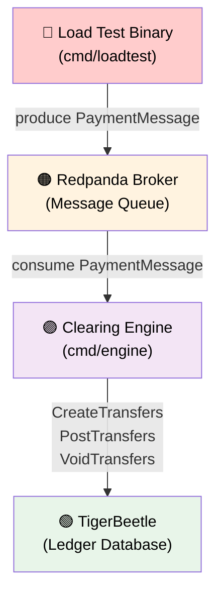

### Deployment Topology

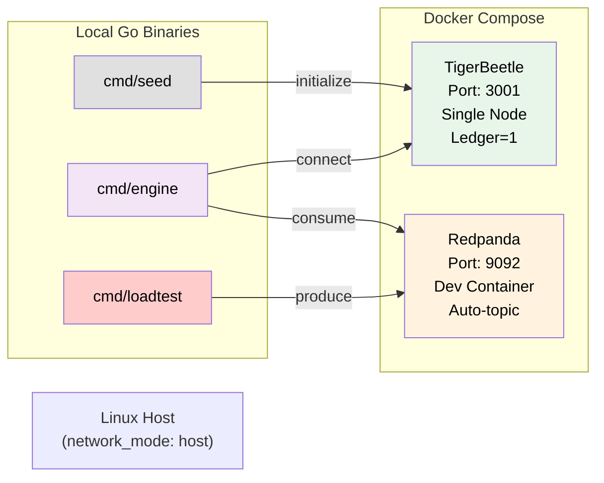

---

## Component Details

### 1. Load Test Binary (cmd/loadtest)

Generates synthetic payment load and measures end-to-end latency.

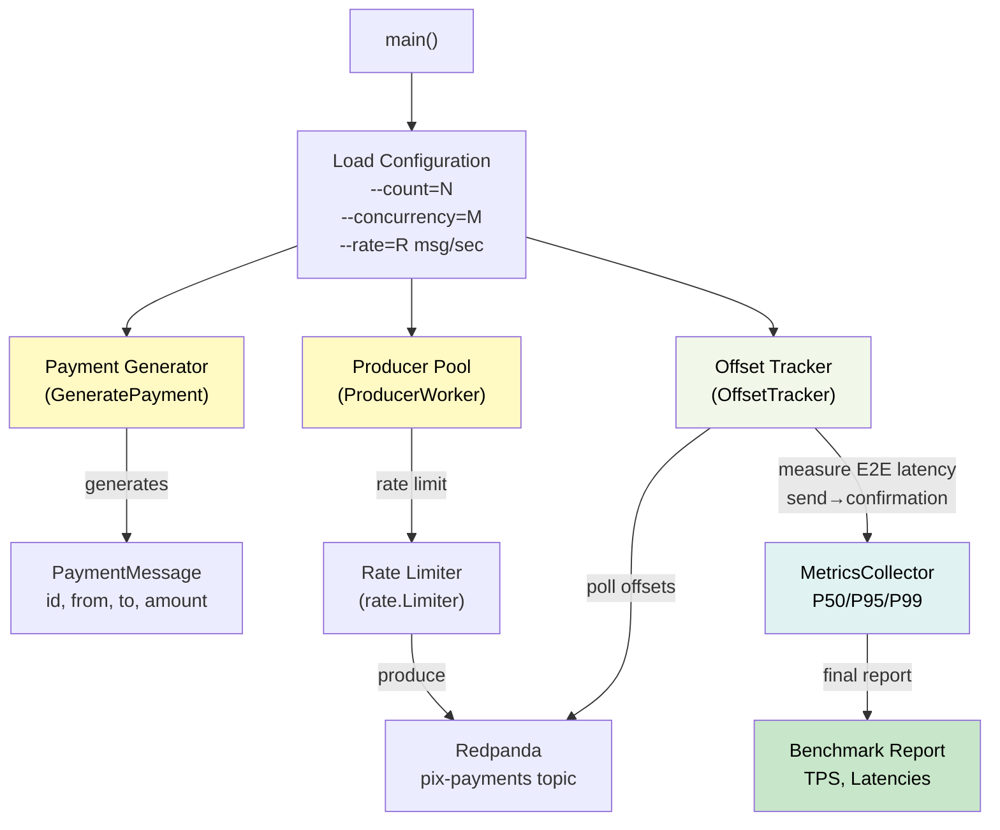

**Key Functions**:
- `GeneratePayment()` - Creates random valid payments with sender/receiver balance checks
- `ProducerWorker` - Submits messages with rate limiting and tracks send times
- `OffsetTracker` - Polls consumer offsets to detect when Phase 2 confirms completion
- `MetricsCollector` - Aggregates P50/P95/P99 percentiles for producer and E2E latency

**Parallelism**: Configurable workers (default 10) produce concurrently to the same topic.

---

### 2. Clearing Engine (cmd/engine)

Implements the settlement logic: consumes payments, executes 2PC, manages offsets.

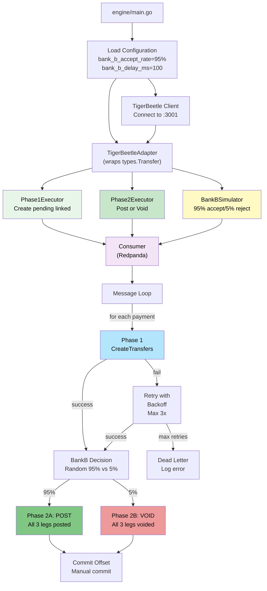

**Consumer Loop Process**:

1. **Fetch Messages**: Consume from `pix-payments` topic
2. **Phase 1**: Create 3 pending linked transfers atomically
   - All succeed → continue to Phase 2
   - Any fail → retry with exponential backoff (max 3 retries)
   - Max retries exceeded → log error, commit offset
3. **Bank B Decision**: Simulate Bank B acceptance (95%) or rejection (5%)
4. **Phase 2**: Either POST all 3 (accept) or VOID all 3 (reject)
5. **Offset Commit**: Commit offset ONLY after Phase 2 completes

**Guarantees**:
- No offset commit until settlement finishes
- On crash during Phase 2, Kafka retries the message with same Phase 1 pending transfers
- Deterministic IDs ensure Phase 1 retry is idempotent

---

### 3. TigerBeetle Instance

Single-node ledger database with atomic transfer semantics.

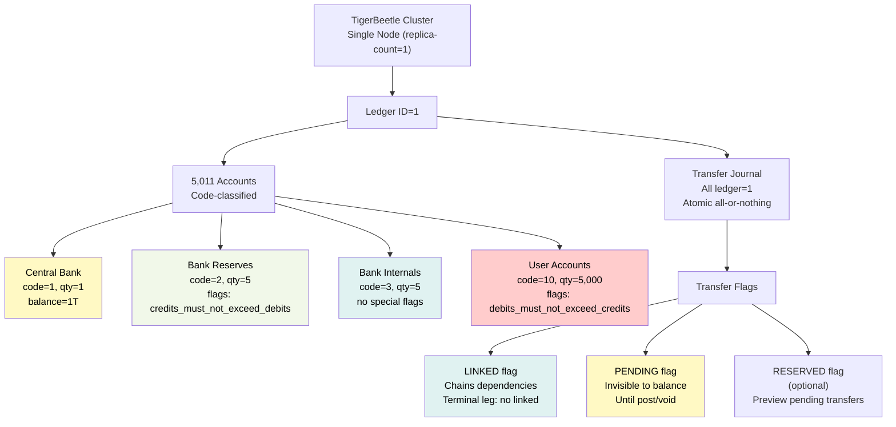

**Account Codes**:

| Code | Name | Count | Flags | Purpose |
|------|------|-------|-------|---------|
| 1 | Central Bank | 1 | none | Source of all funds (infinite credit) |
| 2 | Bank Reserve | 5 | `credits_must_not_exceed_debits` | Per-bank liquidity pool, prevents negative |
| 3 | Bank Internal | 5 | none | Intermediate staging in 3-leg settlement |
| 10 | User Account | 5,000 | `debits_must_not_exceed_credits` | Customer accounts, prevents overdraft |

**Transfer Invariants**:
- All transfers within `ledger=1`
- Linked transfers must follow chain rules (no open chains)
- Pending transfers don't affect available balance
- Posted transfers are final
- Idempotent on transfer ID

---

### 4. Seed Service (cmd/seed)

Bootstraps the ledger with accounts and initial balances.

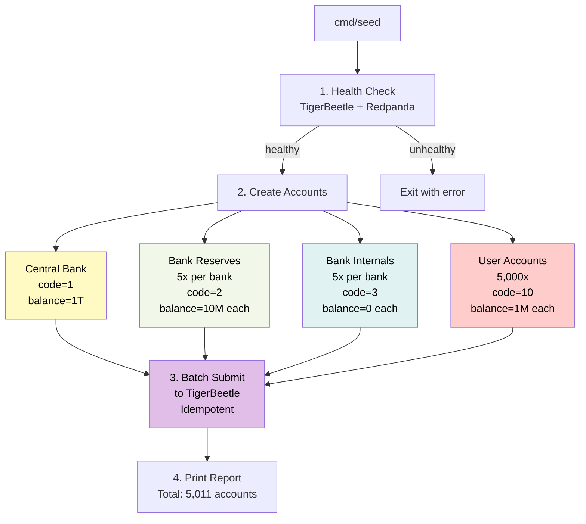

**Idempotency**:
- Account IDs are deterministic (hash of account key)
- Can re-run seed without error if accounts exist
- TigerBeetle rejects duplicate account IDs, but seeder tolerates this

---

## Data Flow

### End-to-End Payment Settlement

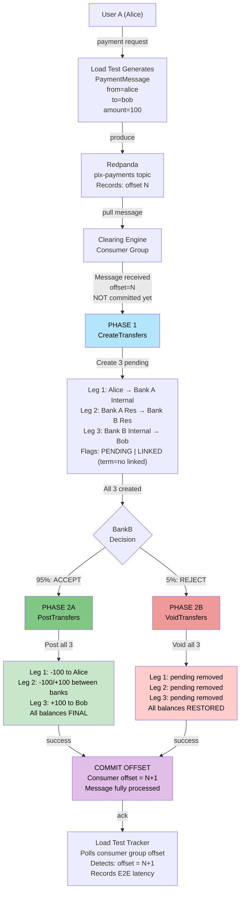

### State Transitions

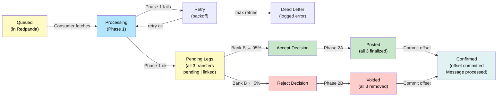

---

## Settlement Engine

### 3-Legged Settlement Model

Every payment from User A (Bank A) to User B (Bank B) involves exactly 3 transfers:

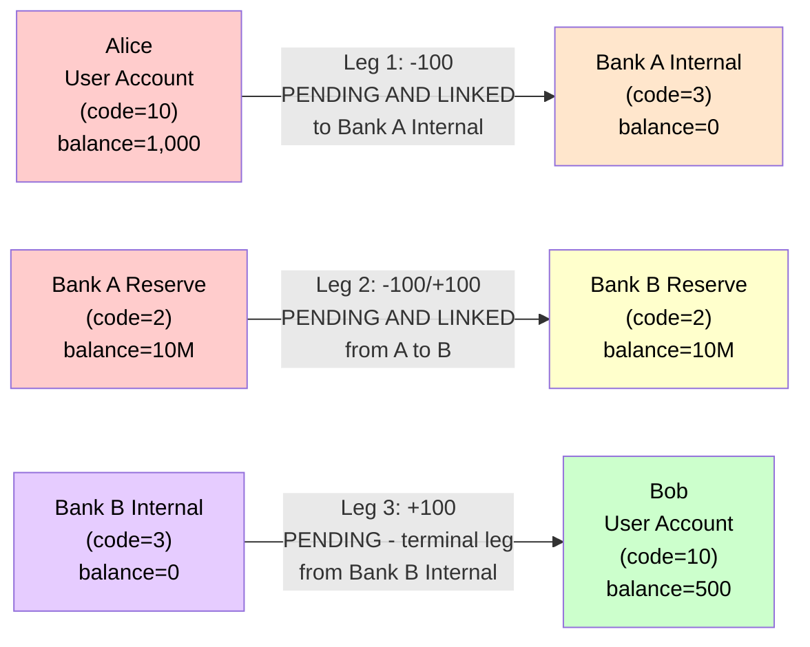

**Why 3 Legs?**

| Leg | From | To | Amount | Flags | Purpose |
|-----|------|----|----|-------|---------|
| 1 | User A | Bank A Internal | 100 | PENDING, LINKED | Debits user; funds "in flight" |
| 2 | Bank A Reserve | Bank B Reserve | 100 | PENDING, LINKED | Interbank movement; chains to Leg 3 |
| 3 | Bank B Internal | User B | 100 | PENDING (no linked) | Credits user; terminal leg |

**Phase 1: Create Pending**

All 3 transfers are created with `PENDING | LINKED` flags. Balances are **unchanged** (pending doesn't affect available balance).

```go
transfers := []types.Transfer{
    {ID: id(payment_uuid, 1), DebitAccount: alice, CreditAccount: bank_a_internal,
     Amount: 100, Flags: PENDING | LINKED, LinkedFlag: true},
    {ID: id(payment_uuid, 2), DebitAccount: bank_a_reserve, CreditAccount: bank_b_reserve,
     Amount: 100, Flags: PENDING | LINKED, LinkedFlag: true},
    {ID: id(payment_uuid, 3), DebitAccount: bank_b_internal, CreditAccount: bob,
     Amount: 100, Flags: PENDING, LinkedFlag: false},  // Terminal leg: NO linked
}
results := tb.CreateTransfers(transfers)  // Atomic: all or nothing
```

**Phase 2A: Accept (95% of payments)**

All 3 pending transfers are **posted**, making balances **final**:

```go
results := tb.PostTransfers([]types.Transfer{leg1, leg2, leg3})
// Alice:      balance -= 100 (now -100, final)
// Bank A Res: balance -= 100 (now 9.9M)
// Bank B Res: balance += 100 (now 10.1M)
// Bob:        balance += 100 (now +100, final)
// Commit offset → payment complete
```

**Phase 2B: Reject (5% of payments)**

All 3 pending transfers are **voided**, restoring balances:

```go
results := tb.VoidTransfers([]types.Transfer{leg1, leg2, leg3})
// All pending transfers removed
// Alice:      balance unchanged (still 1,000)
// Bank A Res: balance unchanged (still 10M)
// Bank B Res: balance unchanged (still 10M)
// Bob:        balance unchanged (still 500)
// Commit offset → payment complete (failed)
```

### 2-Phase Commit (2PC) Timeline

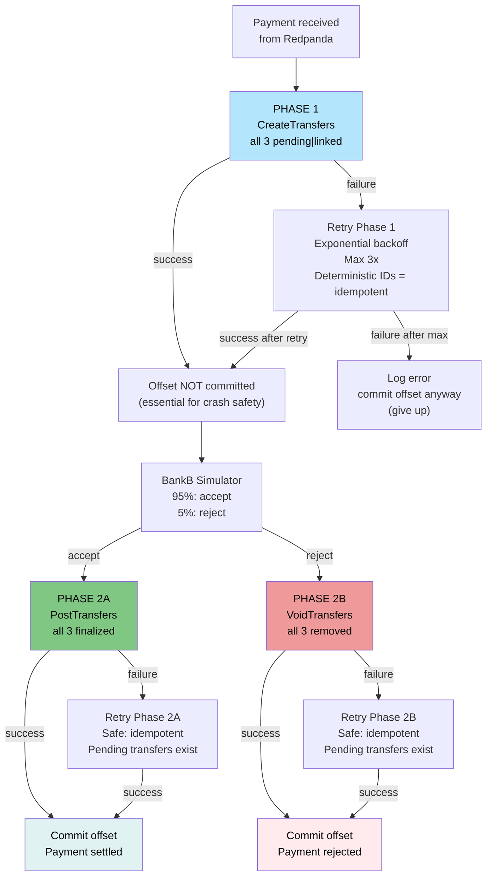

**Key Invariants**:

1. **All-or-Nothing Phase 1**: Legs 1, 2, 3 either all create or all fail
2. **Atomic Phase 2**: All 3 legs post/void together; no partial posts
3. **Offset Safety**: Offset committed only after Phase 2 succeeds
4. **Idempotent Retry**: Deterministic IDs allow safe re-execution

---

## Ledger & Account Model

### Single-Ledger Strategy

TigerbeetleMiniPIX uses a **single ledger (ID=1)** with **code-based account classification**:

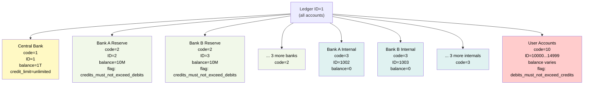

**Advantages**:
1. **No routing**: All transfers within ledger=1 (no cross-ledger errors)
2. **Deterministic codes**: Account type is always visible and consistent
3. **Simpler logic**: No ledger routing tables or mapping
4. **Single journal**: All transfers in one journal (easier auditing)

**Disadvantages**:
1. **Scalability limits**: Single ledger becomes a bottleneck as transaction volume grows; TigerBeetle clusters have finite throughput per ledger
2. **No regulatory isolation**: All account types in one ledger; some regulations require separate ledgers for different entity types or risk categories
3. **Fixed account structure**: Adding new account types requires code changes and potential data migration; less flexible for evolving requirements
4. **ID space constraints**: 64-bit IDs limit total accounts; with 5,000 users, 5 banks, and internal accounts, scaling to millions requires careful ID allocation strategy
5. **Difficult multi-currency support**: Single ledger assumes one currency; multi-currency requires separate ledgers per currency or complex accounting

**Account Identification**:

```
Central Bank:     code=1,  id=1
Bank Reserves:    code=2,  id=2..6 (one per bank)
Bank Internals:   code=3,  id=1002..1006 (one per bank)
User Accounts:    code=10, id=10000..14999 (5,000 users)
```

### Transfer Flags

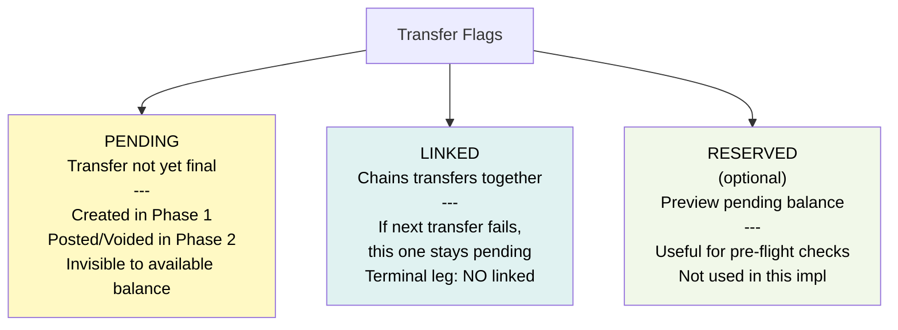

---

## Concurrency & Performance

### Load Test Parallelism

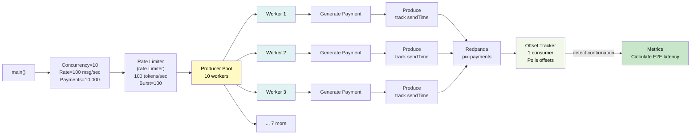

**Performance Characteristics**:

| Metric | Value | Notes |
|--------|-------|-------|
| Producer workers | 10 | Configurable via `--concurrency` |
| Rate limit | 100 msg/sec | Configurable via `--rate` |
| Burst | 100 | Allows spike before throttle |
| Max payments | 10,000 | Default; configurable via `--count` |
| Batch size | 1 | Each payment is 1 message |
| Offset polling | 100ms | Poll interval for E2E tracking |

### TigerBeetle Batch Accumulator

The clearing engine batches Phase 1 and Phase 2 operations:

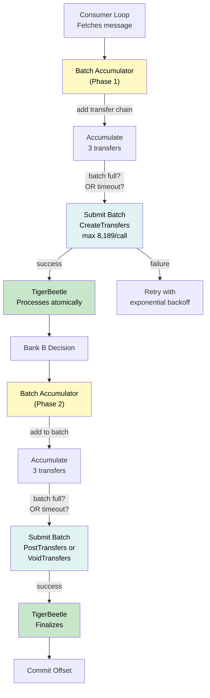

**Batching Strategy**:
- **Phase 1**: Accumulate up to 2,729 payment chains (~8,187 transfers)
- **Phase 2**: Accumulate up to 2,729 payment chains (~8,187 transfers)
- **Timeout**: Flush batch every 100ms if not full
- **Benefit**: Reduces TigerBeetle round-trips by ~2,700x (vs one per payment)

---

## Error Handling & Recovery

### Phase 1 Error Classification

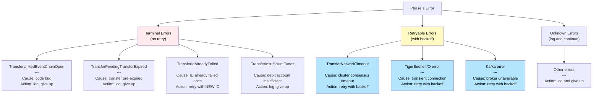

**Retry Strategy**:

```
Attempt 1: Immediate
Attempt 2: Wait 100ms
Attempt 3: Wait 300ms (total 400ms)
Attempt 4: Wait 900ms (total 1.3s)
Max retries: 3
```

**Idempotency**:
- **Phase 1 retry**: Use SAME transfer IDs (deterministic)
- **ID already failed**: Generate NEW IDs with suffix (per phase1_retry_test.go)
- **Phase 2 retry**: Safe to repeat (pending transfers still exist)

### Offset Commit Safety

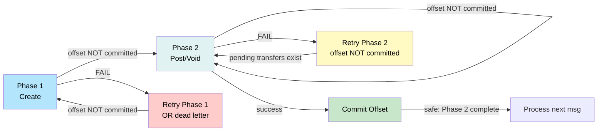

**Crash Safety**:

1. **Crash during Phase 1**: Kafka retries message, Phase 1 repeats (idempotent)
2. **Crash after Phase 1, before Phase 2**: Kafka retries, Phase 1 pending transfers exist in TigerBeetle, Phase 2 repeats (idempotent)
3. **Crash after Phase 2, before offset commit**: Kafka retries, Phase 1 already posted/voided, Phase 2 repeat tries to post/void again (idempotent)

---

## Testing & Verification

### Test Coverage

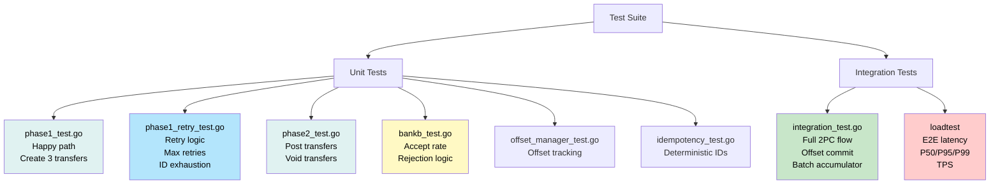

### Verification Checklist

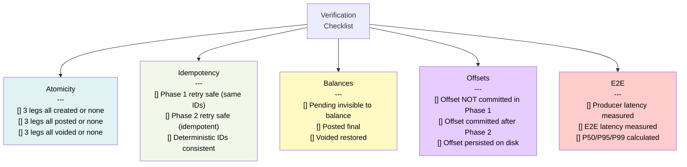

### Load Test Verification

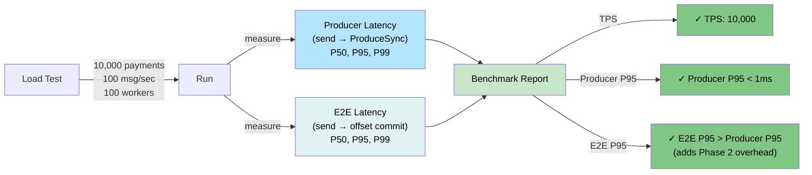
